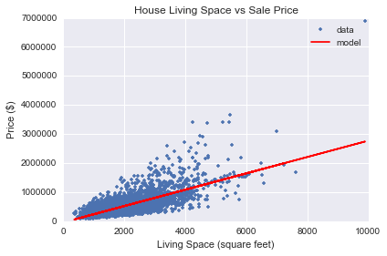

Predicting Housing Prices
=========================

Fire up graphlab create
-----------------------

.. code:: python

    import graphlab
    import numpy
    import locale
    import pandas
    import matplotlib.pyplot as plt
    import seaborn

.. parsed-literal::

    [INFO] 1449348214 : INFO:     (initialize_globals_from_environment:282): Setting configuration variable GRAPHLAB_FILEIO_ALTERNATIVE_SSL_CERT_FILE to /home/charon/.virtualenvs/machinelearning/local/lib/python2.7/site-packages/certifi/cacert.pem
    1449348214 : INFO:     (initialize_globals_from_environment:282): Setting configuration variable GRAPHLAB_FILEIO_ALTERNATIVE_SSL_CERT_DIR to 
    This non-commercial license of GraphLab Create is assigned to necromuralist@gmail.com and will expire on October 20, 2016. For commercial licensing options, visit https://dato.com/buy/.
    
    [INFO] Start server at: ipc:///tmp/graphlab_server-906 - Server binary: /home/charon/.virtualenvs/machinelearning/lib/python2.7/site-packages/graphlab/unity_server - Server log: /tmp/graphlab_server_1449348214.log
    [INFO] GraphLab Server Version: 1.7.1

.. code:: python

    %matplotlib inline

Load some house sales data
--------------------------

Dataset is from house sales in King County, the region where the city of
Seattle, WA is located.

.. code:: python

    sales = graphlab.SFrame('large_data/home_data.gl/')
    frame = pandas.read_csv('large_data/home_data.csv')

.. code:: python

    head_frame = sales.head(2)

.. code:: python

    frame.head()

.. raw:: html

    

    <table border="1" class="dataframe">
      <thead>
        <tr style="text-align: right;">
          <th></th>
          <th>id</th>
          <th>date</th>
          <th>price</th>
          <th>bedrooms</th>
          <th>bathrooms</th>
          <th>sqft_living</th>
          <th>sqft_lot</th>
          <th>floors</th>
          <th>waterfront</th>
          <th>view</th>
          <th>...</th>
          <th>grade</th>
          <th>sqft_above</th>
          <th>sqft_basement</th>
          <th>yr_built</th>
          <th>yr_renovated</th>
          <th>zipcode</th>
          <th>lat</th>
          <th>long</th>
          <th>sqft_living15</th>
          <th>sqft_lot15</th>
        </tr>
      </thead>
      <tbody>
        <tr>
          <th>0</th>
          <td>7129300520</td>
          <td>20141013T000000</td>
          <td>221900</td>
          <td>3</td>
          <td>1.00</td>
          <td>1180</td>
          <td>5650</td>
          <td>1</td>
          <td>0</td>
          <td>0</td>
          <td>...</td>
          <td>7</td>
          <td>1180</td>
          <td>0</td>
          <td>1955</td>
          <td>0</td>
          <td>98178</td>
          <td>47.5112</td>
          <td>-122.257</td>
          <td>1340</td>
          <td>5650</td>
        </tr>
        <tr>
          <th>1</th>
          <td>6414100192</td>
          <td>20141209T000000</td>
          <td>538000</td>
          <td>3</td>
          <td>2.25</td>
          <td>2570</td>
          <td>7242</td>
          <td>2</td>
          <td>0</td>
          <td>0</td>
          <td>...</td>
          <td>7</td>
          <td>2170</td>
          <td>400</td>
          <td>1951</td>
          <td>1991</td>
          <td>98125</td>
          <td>47.7210</td>
          <td>-122.319</td>
          <td>1690</td>
          <td>7639</td>
        </tr>
        <tr>
          <th>2</th>
          <td>5631500400</td>
          <td>20150225T000000</td>
          <td>180000</td>
          <td>2</td>
          <td>1.00</td>
          <td>770</td>
          <td>10000</td>
          <td>1</td>
          <td>0</td>
          <td>0</td>
          <td>...</td>
          <td>6</td>
          <td>770</td>
          <td>0</td>
          <td>1933</td>
          <td>0</td>
          <td>98028</td>
          <td>47.7379</td>
          <td>-122.233</td>
          <td>2720</td>
          <td>8062</td>
        </tr>
        <tr>
          <th>3</th>
          <td>2487200875</td>
          <td>20141209T000000</td>
          <td>604000</td>
          <td>4</td>
          <td>3.00</td>
          <td>1960</td>
          <td>5000</td>
          <td>1</td>
          <td>0</td>
          <td>0</td>
          <td>...</td>
          <td>7</td>
          <td>1050</td>
          <td>910</td>
          <td>1965</td>
          <td>0</td>
          <td>98136</td>
          <td>47.5208</td>
          <td>-122.393</td>
          <td>1360</td>
          <td>5000</td>
        </tr>
        <tr>
          <th>4</th>
          <td>1954400510</td>
          <td>20150218T000000</td>
          <td>510000</td>
          <td>3</td>
          <td>2.00</td>
          <td>1680</td>
          <td>8080</td>
          <td>1</td>
          <td>0</td>
          <td>0</td>
          <td>...</td>
          <td>8</td>
          <td>1680</td>
          <td>0</td>
          <td>1987</td>
          <td>0</td>
          <td>98074</td>
          <td>47.6168</td>
          <td>-122.045</td>
          <td>1800</td>
          <td>7503</td>
        </tr>
      </tbody>
    </table>
    
5 rows × 21 columns

    

Exploring the data for housing sales
------------------------------------

The house price is correlated with the number of square feet of living
space.

.. code:: python

    graphlab.canvas.set_target('ipynb')
    sales.show(view="Scatter Plot", x="sqft_living", y="price")

Create a simple regression model of sqft\_living to price
---------------------------------------------------------

Split data into training and testing.
-------------------------------------

We use ``seed=0`` so that everyone running this notebook gets the same
results. In practice, you may set a random seed (or let GraphLab Create
pick a random seed for you).

.. code:: python

    train_data, test_data = sales.random_split(.8,seed=0)

Build the regression model using only sqft\_living as a feature
---------------------------------------------------------------

.. code:: python

    sqft_model = graphlab.linear_regression.create(train_data, target='price', features=['sqft_living'], validation_set=None)

.. parsed-literal::

    PROGRESS: Linear regression:
    PROGRESS: --------------------------------------------------------
    PROGRESS: Number of examples          : 17384
    PROGRESS: Number of features          : 1
    PROGRESS: Number of unpacked features : 1
    PROGRESS: Number of coefficients    : 2
    PROGRESS: Starting Newton Method
    PROGRESS: --------------------------------------------------------
    PROGRESS: +-----------+----------+--------------+--------------------+---------------+
    PROGRESS: | Iteration | Passes   | Elapsed Time | Training-max_error | Training-rmse |
    PROGRESS: +-----------+----------+--------------+--------------------+---------------+
    PROGRESS: | 1         | 2        | 1.007022     | 4349521.926170     | 262943.613754 |
    PROGRESS: +-----------+----------+--------------+--------------------+---------------+
    PROGRESS: SUCCESS: Optimal solution found.
    PROGRESS:

Evaluate the simple model
-------------------------

.. code:: python

    print( test_data['price'].mean())

.. parsed-literal::

    543054.042563

.. code:: python

    print sqft_model.evaluate(test_data)

.. parsed-literal::

    {'max_error': 4143550.8825285938, 'rmse': 255191.02870527358}

RMSE of about $255,170!

Let's show what our predictions look like
-----------------------------------------

Matplotlib is a Python plotting library that is also useful for
plotting. You can install it with:

'pip install matplotlib'

.. code:: python

    figure = plt.figure()
    axe = figure.gca()
    lines = axe.plot(test_data['sqft_living'],test_data['price'],'.', label='data')
    lines = axe.plot(test_data['sqft_living'],sqft_model.predict(test_data),'r-', label='model')
    axe.set_ylabel("Price ($)")
    axe.set_xlabel("Living Space (square feet)")
    axe.legend()
    title = axe.set_title("House Living Space vs Sale Price")

Above: blue dots are original data, red line is the prediction from the
simple regression.

Below: we can view the learned regression coefficients.

.. code:: python

    sqft_model.get('coefficients')

.. raw:: html

    
<table frame="box" rules="cols">
        <tr>
            <th style="padding-left: 1em; padding-right: 1em; text-align: center">name</th>
            <th style="padding-left: 1em; padding-right: 1em; text-align: center">index</th>
            <th style="padding-left: 1em; padding-right: 1em; text-align: center">value</th>
        </tr>
        <tr>
            <td style="padding-left: 1em; padding-right: 1em; text-align: center; vertical-align: top">(intercept)</td>
            <td style="padding-left: 1em; padding-right: 1em; text-align: center; vertical-align: top">None</td>
            <td style="padding-left: 1em; padding-right: 1em; text-align: center; vertical-align: top">-47114.0206702</td>
        </tr>
        <tr>
            <td style="padding-left: 1em; padding-right: 1em; text-align: center; vertical-align: top">sqft_living</td>
            <td style="padding-left: 1em; padding-right: 1em; text-align: center; vertical-align: top">None</td>
            <td style="padding-left: 1em; padding-right: 1em; text-align: center; vertical-align: top">281.957850166</td>
        </tr>
    </table>
    [2 rows x 3 columns] 
    

Explore other features in the data
----------------------------------

To build a more elaborate model, we will explore using more features.

.. code:: python

    my_features = ['bedrooms', 'bathrooms', 'sqft_living', 'sqft_lot', 'floors', 'zipcode']

.. code:: python

    sales[my_features].show()

.. code:: python

    sales.show(view='BoxWhisker Plot', x='zipcode', y='price')

Pull the bar at the bottom to view more of the data.

98039 is the most expensive zip code.

Build a regression model with more features
-------------------------------------------

.. code:: python

    my_features_model = graphlab.linear_regression.create(train_data,target='price',features=my_features,validation_set=None)

.. parsed-literal::

    PROGRESS: Linear regression:
    PROGRESS: --------------------------------------------------------
    PROGRESS: Number of examples          : 17384
    PROGRESS: Number of features          : 6
    PROGRESS: Number of unpacked features : 6
    PROGRESS: Number of coefficients    : 115
    PROGRESS: Starting Newton Method
    PROGRESS: --------------------------------------------------------
    PROGRESS: +-----------+----------+--------------+--------------------+---------------+
    PROGRESS: | Iteration | Passes   | Elapsed Time | Training-max_error | Training-rmse |
    PROGRESS: +-----------+----------+--------------+--------------------+---------------+
    PROGRESS: | 1         | 2        | 0.037078     | 3763208.270523     | 181908.848367 |
    PROGRESS: +-----------+----------+--------------+--------------------+---------------+
    PROGRESS: SUCCESS: Optimal solution found.
    PROGRESS:

.. code:: python

    print my_features

.. parsed-literal::

    ['bedrooms', 'bathrooms', 'sqft_living', 'sqft_lot', 'floors', 'zipcode']

Comparing the results of the simple model with adding more features
-------------------------------------------------------------------

.. code:: python

    print sqft_model.evaluate(test_data)
    print my_features_model.evaluate(test_data)

.. parsed-literal::

    {'max_error': 4143550.8825285938, 'rmse': 255191.02870527358}
    {'max_error': 3486584.509381705, 'rmse': 179542.4333126903}

The RMSE goes down from $255,170 to $179,508 with more features.

Apply learned models to predict prices of 3 houses
--------------------------------------------------

The first house we will use is considered an "average" house in Seattle.

.. code:: python

    house1 = sales[sales['id']=='5309101200']

.. code:: python

    house1

.. raw:: html

    
<table frame="box" rules="cols">
        <tr>
            <th style="padding-left: 1em; padding-right: 1em; text-align: center">id</th>
            <th style="padding-left: 1em; padding-right: 1em; text-align: center">date</th>
            <th style="padding-left: 1em; padding-right: 1em; text-align: center">price</th>
            <th style="padding-left: 1em; padding-right: 1em; text-align: center">bedrooms</th>
            <th style="padding-left: 1em; padding-right: 1em; text-align: center">bathrooms</th>
            <th style="padding-left: 1em; padding-right: 1em; text-align: center">sqft_living</th>
            <th style="padding-left: 1em; padding-right: 1em; text-align: center">sqft_lot</th>
            <th style="padding-left: 1em; padding-right: 1em; text-align: center">floors</th>
            <th style="padding-left: 1em; padding-right: 1em; text-align: center">waterfront</th>
        </tr>
        <tr>
            <td style="padding-left: 1em; padding-right: 1em; text-align: center; vertical-align: top">5309101200</td>
            <td style="padding-left: 1em; padding-right: 1em; text-align: center; vertical-align: top">2014-06-05 00:00:00+00:00</td>
            <td style="padding-left: 1em; padding-right: 1em; text-align: center; vertical-align: top">620000</td>
            <td style="padding-left: 1em; padding-right: 1em; text-align: center; vertical-align: top">4</td>
            <td style="padding-left: 1em; padding-right: 1em; text-align: center; vertical-align: top">2.25</td>
            <td style="padding-left: 1em; padding-right: 1em; text-align: center; vertical-align: top">2400</td>
            <td style="padding-left: 1em; padding-right: 1em; text-align: center; vertical-align: top">5350</td>
            <td style="padding-left: 1em; padding-right: 1em; text-align: center; vertical-align: top">1.5</td>
            <td style="padding-left: 1em; padding-right: 1em; text-align: center; vertical-align: top">0</td>
        </tr>
    </table>
    <table frame="box" rules="cols">
        <tr>
            <th style="padding-left: 1em; padding-right: 1em; text-align: center">view</th>
            <th style="padding-left: 1em; padding-right: 1em; text-align: center">condition</th>
            <th style="padding-left: 1em; padding-right: 1em; text-align: center">grade</th>
            <th style="padding-left: 1em; padding-right: 1em; text-align: center">sqft_above</th>
            <th style="padding-left: 1em; padding-right: 1em; text-align: center">sqft_basement</th>
            <th style="padding-left: 1em; padding-right: 1em; text-align: center">yr_built</th>
            <th style="padding-left: 1em; padding-right: 1em; text-align: center">yr_renovated</th>
            <th style="padding-left: 1em; padding-right: 1em; text-align: center">zipcode</th>
            <th style="padding-left: 1em; padding-right: 1em; text-align: center">lat</th>
        </tr>
        <tr>
            <td style="padding-left: 1em; padding-right: 1em; text-align: center; vertical-align: top">0</td>
            <td style="padding-left: 1em; padding-right: 1em; text-align: center; vertical-align: top">4</td>
            <td style="padding-left: 1em; padding-right: 1em; text-align: center; vertical-align: top">7</td>
            <td style="padding-left: 1em; padding-right: 1em; text-align: center; vertical-align: top">1460</td>
            <td style="padding-left: 1em; padding-right: 1em; text-align: center; vertical-align: top">940</td>
            <td style="padding-left: 1em; padding-right: 1em; text-align: center; vertical-align: top">1929</td>
            <td style="padding-left: 1em; padding-right: 1em; text-align: center; vertical-align: top">0</td>
            <td style="padding-left: 1em; padding-right: 1em; text-align: center; vertical-align: top">98117</td>
            <td style="padding-left: 1em; padding-right: 1em; text-align: center; vertical-align: top">47.67632376</td>
        </tr>
    </table>
    <table frame="box" rules="cols">
        <tr>
            <th style="padding-left: 1em; padding-right: 1em; text-align: center">long</th>
            <th style="padding-left: 1em; padding-right: 1em; text-align: center">sqft_living15</th>
            <th style="padding-left: 1em; padding-right: 1em; text-align: center">sqft_lot15</th>
        </tr>
        <tr>
            <td style="padding-left: 1em; padding-right: 1em; text-align: center; vertical-align: top">-122.37010126</td>
            <td style="padding-left: 1em; padding-right: 1em; text-align: center; vertical-align: top">1250.0</td>
            <td style="padding-left: 1em; padding-right: 1em; text-align: center; vertical-align: top">4880.0</td>
        </tr>
    </table>
    [? rows x 21 columns] Note: Only the head of the SFrame is printed. This SFrame is lazily evaluated. You can use len(sf) to force materialization.
    

.. code:: python

    print house1['price']

.. parsed-literal::

    [620000, ... ]

.. code:: python

    print sqft_model.predict(house1)

.. parsed-literal::

    [629584.8197281545]

.. code:: python

    print my_features_model.predict(house1)

.. parsed-literal::

    [721918.9333272863]

In this case, the model with more features provides a worse prediction
than the simpler model with only 1 feature. However, on average, the
model with more features is better.

Prediction for a second, fancier house
--------------------------------------

We will now examine the predictions for a fancier house.

.. code:: python

    house2 = sales[sales['id']=='1925069082']

.. code:: python

    house2

.. raw:: html

    
<table frame="box" rules="cols">
        <tr>
            <th style="padding-left: 1em; padding-right: 1em; text-align: center">id</th>
            <th style="padding-left: 1em; padding-right: 1em; text-align: center">date</th>
            <th style="padding-left: 1em; padding-right: 1em; text-align: center">price</th>
            <th style="padding-left: 1em; padding-right: 1em; text-align: center">bedrooms</th>
            <th style="padding-left: 1em; padding-right: 1em; text-align: center">bathrooms</th>
            <th style="padding-left: 1em; padding-right: 1em; text-align: center">sqft_living</th>
            <th style="padding-left: 1em; padding-right: 1em; text-align: center">sqft_lot</th>
            <th style="padding-left: 1em; padding-right: 1em; text-align: center">floors</th>
            <th style="padding-left: 1em; padding-right: 1em; text-align: center">waterfront</th>
        </tr>
        <tr>
            <td style="padding-left: 1em; padding-right: 1em; text-align: center; vertical-align: top">1925069082</td>
            <td style="padding-left: 1em; padding-right: 1em; text-align: center; vertical-align: top">2015-05-11 00:00:00+00:00</td>
            <td style="padding-left: 1em; padding-right: 1em; text-align: center; vertical-align: top">2200000</td>
            <td style="padding-left: 1em; padding-right: 1em; text-align: center; vertical-align: top">5</td>
            <td style="padding-left: 1em; padding-right: 1em; text-align: center; vertical-align: top">4.25</td>
            <td style="padding-left: 1em; padding-right: 1em; text-align: center; vertical-align: top">4640</td>
            <td style="padding-left: 1em; padding-right: 1em; text-align: center; vertical-align: top">22703</td>
            <td style="padding-left: 1em; padding-right: 1em; text-align: center; vertical-align: top">2</td>
            <td style="padding-left: 1em; padding-right: 1em; text-align: center; vertical-align: top">1</td>
        </tr>
    </table>
    <table frame="box" rules="cols">
        <tr>
            <th style="padding-left: 1em; padding-right: 1em; text-align: center">view</th>
            <th style="padding-left: 1em; padding-right: 1em; text-align: center">condition</th>
            <th style="padding-left: 1em; padding-right: 1em; text-align: center">grade</th>
            <th style="padding-left: 1em; padding-right: 1em; text-align: center">sqft_above</th>
            <th style="padding-left: 1em; padding-right: 1em; text-align: center">sqft_basement</th>
            <th style="padding-left: 1em; padding-right: 1em; text-align: center">yr_built</th>
            <th style="padding-left: 1em; padding-right: 1em; text-align: center">yr_renovated</th>
            <th style="padding-left: 1em; padding-right: 1em; text-align: center">zipcode</th>
            <th style="padding-left: 1em; padding-right: 1em; text-align: center">lat</th>
        </tr>
        <tr>
            <td style="padding-left: 1em; padding-right: 1em; text-align: center; vertical-align: top">4</td>
            <td style="padding-left: 1em; padding-right: 1em; text-align: center; vertical-align: top">5</td>
            <td style="padding-left: 1em; padding-right: 1em; text-align: center; vertical-align: top">8</td>
            <td style="padding-left: 1em; padding-right: 1em; text-align: center; vertical-align: top">2860</td>
            <td style="padding-left: 1em; padding-right: 1em; text-align: center; vertical-align: top">1780</td>
            <td style="padding-left: 1em; padding-right: 1em; text-align: center; vertical-align: top">1952</td>
            <td style="padding-left: 1em; padding-right: 1em; text-align: center; vertical-align: top">0</td>
            <td style="padding-left: 1em; padding-right: 1em; text-align: center; vertical-align: top">98052</td>
            <td style="padding-left: 1em; padding-right: 1em; text-align: center; vertical-align: top">47.63925783</td>
        </tr>
    </table>
    <table frame="box" rules="cols">
        <tr>
            <th style="padding-left: 1em; padding-right: 1em; text-align: center">long</th>
            <th style="padding-left: 1em; padding-right: 1em; text-align: center">sqft_living15</th>
            <th style="padding-left: 1em; padding-right: 1em; text-align: center">sqft_lot15</th>
        </tr>
        <tr>
            <td style="padding-left: 1em; padding-right: 1em; text-align: center; vertical-align: top">-122.09722322</td>
            <td style="padding-left: 1em; padding-right: 1em; text-align: center; vertical-align: top">3140.0</td>
            <td style="padding-left: 1em; padding-right: 1em; text-align: center; vertical-align: top">14200.0</td>
        </tr>
    </table>
    [? rows x 21 columns] Note: Only the head of the SFrame is printed. This SFrame is lazily evaluated. You can use len(sf) to force materialization.
    

.. code:: python

    print sqft_model.predict(house2)

.. parsed-literal::

    [1261170.404099968]

.. code:: python

    print my_features_model.predict(house2)

.. parsed-literal::

    [1446472.4690774973]

In this case, the model with more features provides a better prediction.
This behavior is expected here, because this house is more
differentiated by features that go beyond its square feet of living
space, especially the fact that it's a waterfront house.

Last house, super fancy
-----------------------

Our last house is a very large one owned by a famous Seattleite.

.. code:: python

    bill_gates = {'bedrooms':[8], 
                  'bathrooms':[25], 
                  'sqft_living':[50000], 
                  'sqft_lot':[225000],
                  'floors':[4], 
                  'zipcode':['98039'], 
                  'condition':[10], 
                  'grade':[10],
                  'waterfront':[1],
                  'view':[4],
                  'sqft_above':[37500],
                  'sqft_basement':[12500],
                  'yr_built':[1994],
                  'yr_renovated':[2010],
                  'lat':[47.627606],
                  'long':[-122.242054],
                  'sqft_living15':[5000],
                  'sqft_lot15':[40000]}

.. code:: python

    print my_features_model.predict(graphlab.SFrame(bill_gates))

.. parsed-literal::

    [13749825.525719076]

The model predicts a price of over $13M for this house! But we expect
the house to cost much more. (There are very few samples in the dataset
of houses that are this fancy, so we don't expect the model to capture a
perfect prediction here.)

Quiz
====

Selection and Summary Statistics
--------------------------------

Mean sales price of most expensive zip-code
~~~~~~~~~~~~~~~~~~~~~~~~~~~~~~~~~~~~~~~~~~~

.. code:: python

    zips = sales['zipcode'].unique()
    zip_mean = [(z,sales[sales['zipcode']==z]['price'].mean()) for z in zips]

.. code:: python

    max_mean = max(m for z,m in zip_mean)
    for z,m in zip_mean:
        if m == max_mean:
            zip = z

.. code:: python

    zip

.. parsed-literal::

    '98039'

.. code:: python

    locale.setlocale(locale.LC_ALL, '')
    print(locale.currency(max_mean, grouping=True))

.. parsed-literal::

    $2,160,606.60

Filtering Data
--------------

House Square Footage
~~~~~~~~~~~~~~~~~~~~

select houses where square footage is greater than 2,000 but no larger
than 4,000 square feet.

.. code:: python

    filtered_sales = sales[2000 < sales['sqft_living']]
    filtered_sales = filtered_sales[filtered_sales['sqft_living'] <= 4000]

.. code:: python

    min(filtered_sales['sqft_living'])
    max(filtered_sales['sqft_living'])

.. parsed-literal::

    4000

What fraction of all houses has ``sqft_living`` in this range?
~~~~~~~~~~~~~~~~~~~~~~~~~~~~~~~~~~~~~~~~~~~~~~~~~~~~~~~~~~~~~~

.. code:: python

    len(filtered_sales)/float(len(sales))

.. parsed-literal::

    0.42187572294452413

Regression Model
----------------

.. code:: python

    advanced_features = [
    'bedrooms', 'bathrooms', 'sqft_living', 'sqft_lot', 'floors', 'zipcode',
    'condition', # condition of house				
    'grade', # measure of quality of construction				
    'waterfront', # waterfront property				
    'view', # type of view				
    'sqft_above', # square feet above ground				
    'sqft_basement', # square feet in basement				
    'yr_built', # the year built				
    'yr_renovated', # the year renovated				
    'lat', 'long', # the lat-long of the parcel				
    'sqft_living15', # average sq.ft. of 15 nearest neighbors 				
    'sqft_lot15', # average lot size of 15 nearest neighbors 
    ]

.. code:: python

    adv_model = graphlab.linear_regression.create(train_data, target='price', features=advanced_features, validation_set=None)

.. parsed-literal::

    PROGRESS: Linear regression:
    PROGRESS: --------------------------------------------------------
    PROGRESS: Number of examples          : 17384
    PROGRESS: Number of features          : 18
    PROGRESS: Number of unpacked features : 18
    PROGRESS: Number of coefficients    : 127
    PROGRESS: Starting Newton Method
    PROGRESS: --------------------------------------------------------
    PROGRESS: +-----------+----------+--------------+--------------------+---------------+
    PROGRESS: | Iteration | Passes   | Elapsed Time | Training-max_error | Training-rmse |
    PROGRESS: +-----------+----------+--------------+--------------------+---------------+
    PROGRESS: | 1         | 2        | 0.064805     | 3469012.450686     | 154580.940736 |
    PROGRESS: +-----------+----------+--------------+--------------------+---------------+
    PROGRESS: SUCCESS: Optimal solution found.
    PROGRESS:

.. code:: python

    my_rmse = my_features_model.evaluate(test_data)['rmse']
    adv_rmse = adv_model.evaluate(test_data)['rmse']
    print("RMSE Difference: {0}".format(locale.currency(my_rmse - adv_rmse, grouping=True)))

.. parsed-literal::

    RMSE Difference: $22,711.32

