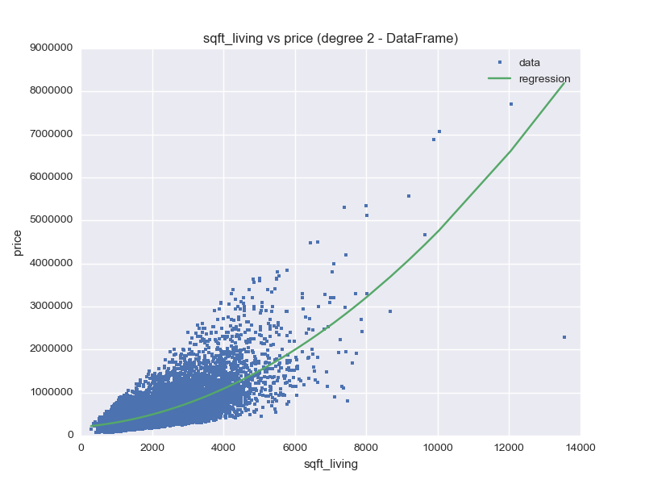
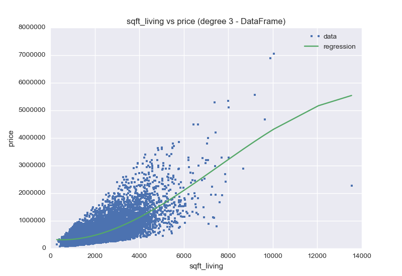
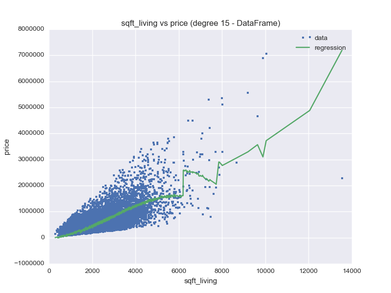
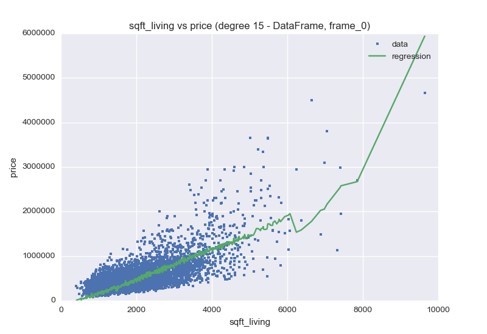
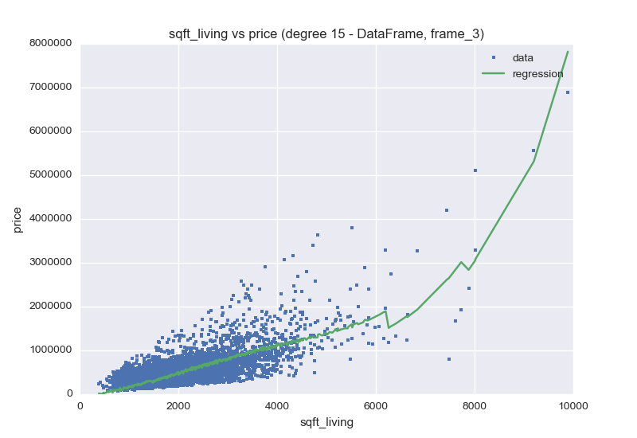
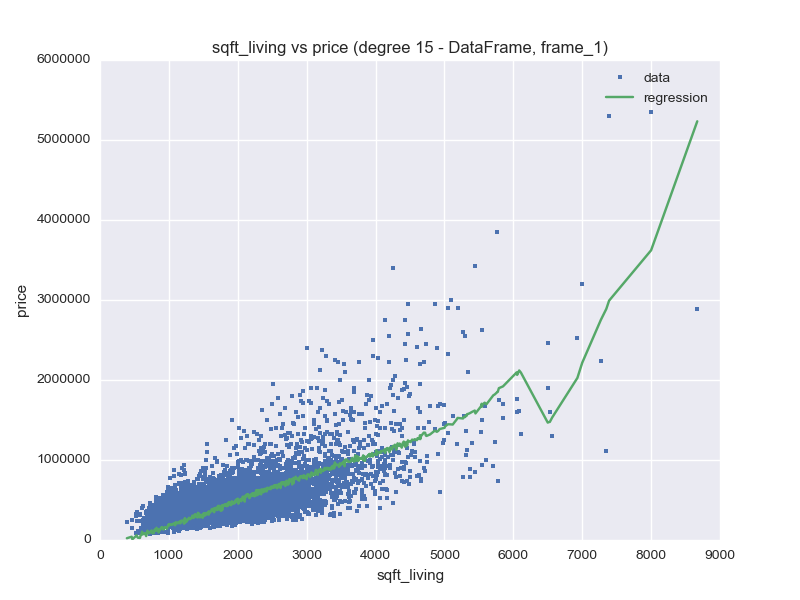
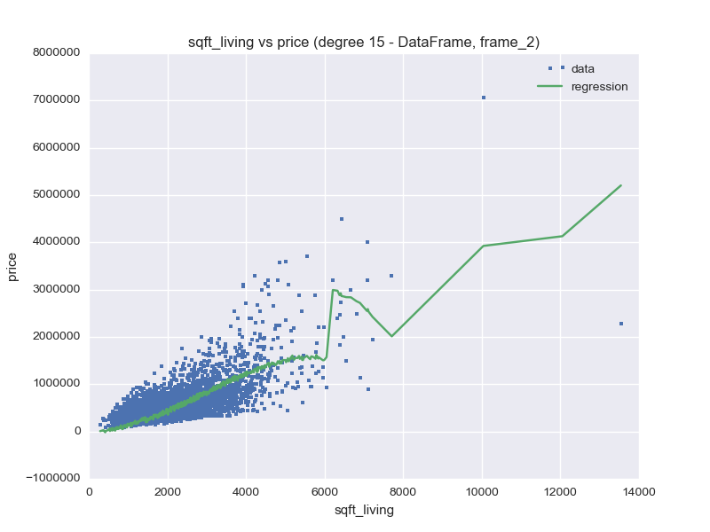
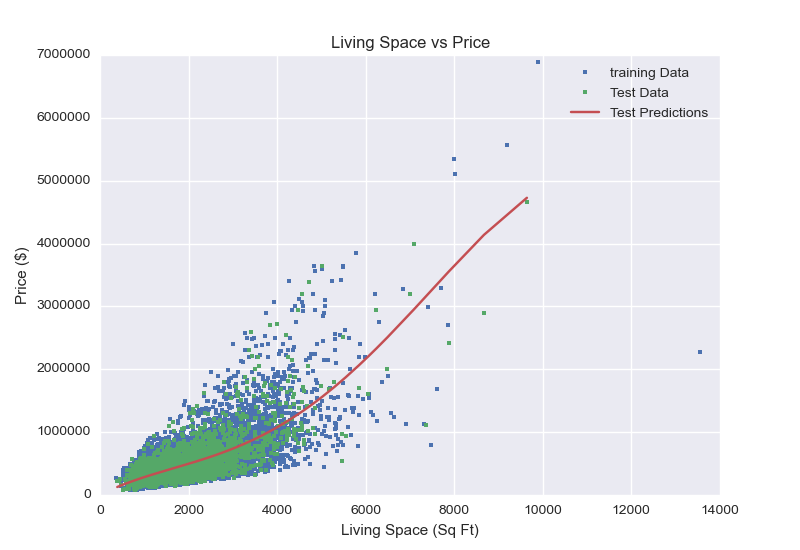

Assessing Fit (polynomial regression with pandas)
=================================================

This is a re-do of the regular assignment using pandas and statsmodels. The code is in the assignment too, but hopefully I can clarify what happened by pulling this out into its own file.

The point of this unit is to use a validation set to find the best model. In this case this is illustrated using polynomial regression.

.. code:: python

    # python standard library
    from collections import namedtuple
    
    # third-party
    import matplotlib.pyplot as plt
    from matplotlib import pylab
    import numpy
    import pandas
    import seaborn
    from sklearn.cross_validation import train_test_split
    import statsmodels.api as statsmodels
    
    # this code
    from regression_model import FrameRegressionModel
    

.. code:: python

    figure_prefix = "polynomial_regression_pandas_"
    

Loading the Data
----------------

.. code:: python

    sales_frame = pandas.read_csv('../../large_data/csvs/kc_house_data.csv')

In order for the line-graph to look correct, the x-axis data ('sqft_living') needs to be sorted.

.. code:: python

    sales_frame = sales_frame.sort_values(by='sqft_living')

Visualizing Polynomial Regression
---------------------------------

Degree 1 (Straight Line)
~~~~~~~~~~~~~~~~~~~~~~~~

.. code:: python

    model_frame_1 = FrameRegressionModel(data=sales_frame)
    coefficients = model_frame_1.coefficients

.. math::
   price &= -43580.74 + 280.62\times sqft\_living\\

Degree 2 (Parabola)
~~~~~~~~~~~~~~~~~~~

.. code:: python

    model_frame_2 = FrameRegressionModel(data=sales_frame, degree=2)
    coefficients = model_frame_2.coefficients

.. math::
   price &= 199222.28 + 67.99\times sqft\_living\\

Degree 3 (Cubic)
~~~~~~~~~~~~~~~~

.. code:: python

    model_frame_3 = FrameRegressionModel(data=sales_frame, degree=3)
    coefficients = model_frame_3.coefficients

.. math::
   price &= 336819.75 + -90.18\times sqft\_living\\

This should look like an 'S'.

15th Degree Polynomial
~~~~~~~~~~~~~~~~~~~~~~

.. code:: python

    model_frame_15 = FrameRegressionModel(data=sales_frame, degree=15)
    coefficients = model_frame_15.coefficients

.. math::
   price &= 0.00 + 0.00\times sqft\_living\\

Now you're starting to see the effects of overfitting.

.. '

Changing the data and re-learning
---------------------------------

The more parameters the model has, the more flexible it is, and also the more *variance* it has (generally speaking). So having a 16-term polynomial might show a lot of variance as the data-sets are changed. To see this effect, the original data is split up into 4 sets so we can compare the models that they produce.

.. code:: python

    train_frame, test_frame = train_test_split(sales_frame, train_size=.5, random_state=0)
    frame_1, frame_2 = train_test_split(train_frame, train_size=.5, random_state=0)
    frame_3, frame_4 = train_test_split(test_frame, train_size=.5, random_state=0)
    frame_list = [frame_1, frame_2, frame_3, frame_4]
    frames = {'frame_{0}'.format(index):frame_list[index] for index in range(len(frame_list))}

.. image:: figures/plot_set_frame_2.png

Selecting a Polynomial Degree
-----------------------------

Whenever we have a "magic" parameter like the degree of the polynomial there is one well-known way to select these parameters -- use a validation set.

We split the sales dataset 3-ways into *training set*, *test set*, and *validation set* as follows:

 * Split our sales data into 2 sets: ``training_and_validation`` and ``testing``. Use a 90:10 split
 * Further split our training data into two sets: ``training`` and ``validation``. Use a 50:50 split

Set ``random_state=1`` to obtain consistent results for different users.

Now try increasing numbers of polynomial terms and find the one with the lowest RSS.

.. code:: python

    FrameRss = namedtuple('FrameRss', 'rss train_model test_model
    predictions'.split())
    

.. image:: figures/polynomial_regression_pandas_FramedRss_1.png
   :width: 15 cm

.. code:: python

    def frame_rss(training, testing, degree, model):
        """
        :param:
         - `training`: SFrame data for training
         - `testing`: SFrame for testing
         - `degree`: Maximum degree for the polynomial data
         - `model`: class definition RegressionModel or
    FrameRegressionModel
        :return: RSS between prediction from training model and testing
    data
        """
        train_model = model(data=training, degree=degree)
        test_model = model(data=testing, degree=degree)
        predictions = train_model.predict(test_model.poly_data)
        residuals = predictions - test_model.data['price']
        return FrameRss(rss=(residuals**2).sum(), train_model=train_model,
                        test_model=test_model, predictions=predictions)
    

.. code:: python

    def plot_train_test(rss):
        figure = plt.figure()
        axe = figure.gca()
        
        lines = axe.plot(rss.train_model.poly_data['power_1'],
                         rss.train_model.data['price'], '.', label='training Data')
        lines = axe.plot(rss.test_model.poly_data['power_1'],
                            rss.test_model.data['price'], '.', label='Test Data')
        lines = axe.plot(rss.test_model.poly_data['power_1'], rss.predictions, '-',
                         label='Test Predictions')
        axe.legend()
        axe.set_xlabel('Living Space (Sq Ft)')
        axe.set_ylabel('Price ($)')
        title = axe.set_title('Living Space vs Price')
        file_path = figure_prefix + "best_rss.png"
        figure.savefig(file_path)
        print(".. image:: " + file_path)
        return

.. code:: python

    train_validate, test = train_test_split(sales_frame, train_size=0.9, random_state=1)
    train, validate = train_test_split(train_validate, train_size=0.5, random_state=1)
    
    train = train.sort_values(by='sqft_living')
    validate = validate.sort_values(by='sqft_living')
    test = test.sort_values(by='sqft_living')

.. code:: python

    frame_rss_s = []
    
    for degree in range(1, 16):
        rss = frame_rss(train, validate, degree,
                        FrameRegressionModel)
        frame_rss_s.append(rss.rss)
    

.. code:: python

    frame_rss_s = numpy.array(frame_rss_s)
    min_rss = frame_rss_s.min()
    min_rss_index = frame_rss_s.argmin()
    min_rss_degree = min_rss_index + 1
    print("Min RSS: {0}".format(min_rss))
    print("Min RSS Index: {0}".format(min_rss_index))
    print("Min RSS Degree: {0}".format(min_rss_degree))
    

.. code::

    Min RSS: 5.93185651099e+14
    Min RSS Index: 3
    Min RSS Degree: 4
    
    

.. code:: python

    rss = frame_rss(train, test, min_rss_degree, FrameRegressionModel)
    print("{0:.5e}".format(rss.rss))
    

.. code::

    1.40800e+14
    
    

.. math::
   price &= 0.46 + 363.43\times sqft\_living\\

